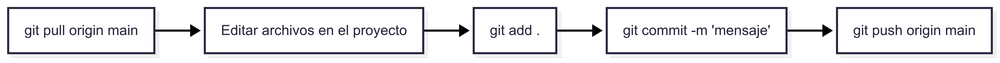

# Semana 2 :o


<!--
En este curso solo usaremos los comandos esenciales de Git para trabajar con repositorios.

---

## 1. Clonar un repositorio

Copia un proyecto de GitHub a tu computadora.

```bash
git clone https://github.com/usuario/repositorio.git
```

---

## 2. Verificar cambios

Muestra qué archivos has modificado o agregado.

```bash
git status
```

---

## 3. Preparar cambios

Agrega archivos para guardarlos en el próximo commit.

```bash
git add archivo.txt
git add .   # agrega todos los archivos modificados
```

---

## 4. Guardar cambios (commit)

Guarda tus cambios con un mensaje descriptivo.

```bash
git commit -m "Descripción breve de los cambios"
```

---

## 5. Subir cambios al repositorio (push)

Envía tus commits locales al repositorio en GitHub.

```bash
git push origin main
```

---

## 6. Traer cambios del remoto (pull)

Actualiza tu proyecto con los últimos cambios de GitHub.

```bash
git pull origin main
```

---
## Flujo típico de trabajo



1. **Traer cambios del remoto**  
   ```bash
   git pull origin main
   ```

2. **Editar** tus archivos de proyecto.

3. **Preparar los cambios**  
   ```bash
   git add .
   ```

4. **Guardar los cambios**  
   ```bash
   git commit -m "Mensaje descriptivo"
   ```

5. **Enviar los cambios al remoto**  
   ```bash
   git push origin main
   ```

---

!!! tip "Consejo"
    Piensa en este ciclo como un **loop infinito**:  
    cada vez que quieras contribuir → primero `pull`, después `add` + `commit`, y finalmente `push`.
    -->
    