# Semana 6 — Generación y selección del concepto de diseño
  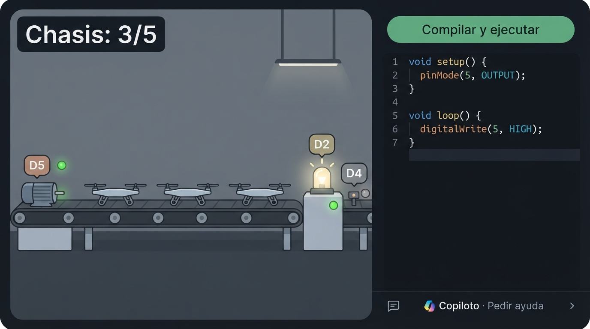{ width="49%" } 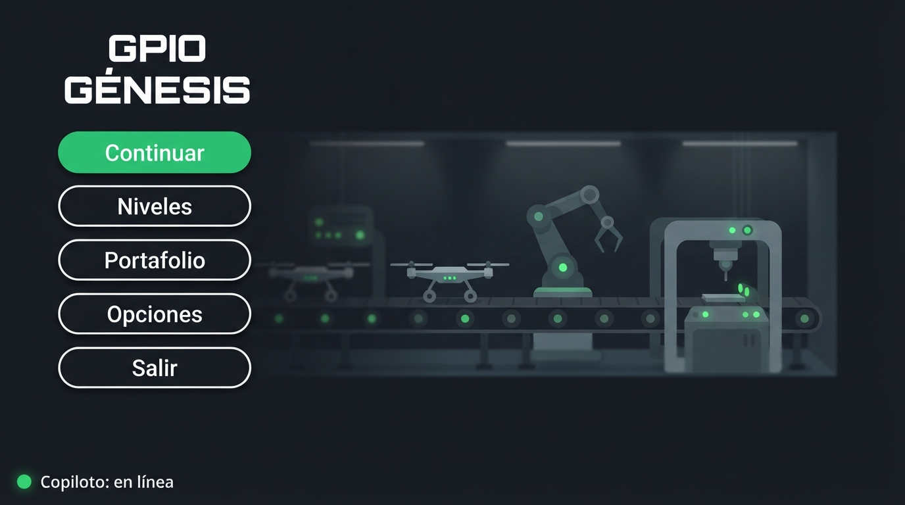{ width="49%" }
**Equipo:** José Carlos y Yael  
**Concepto:** GPIO Génesis — videojuego de simulación de una fábrica de drones donde se programa en C++ real, con un copiloto de IA  
**Tipo de producto:** 100% digital (sin hardware)  
**Fecha:** 1 de octubre de 2026

!!! abstract "De qué trata esta semana"
    En las semanas 4 y 5 decidimos **qué** hace GPIO Génesis y **cómo funciona por dentro** (PDS y arquitectura). Esta semana decidimos **cómo se ve, se siente y se usa**: lo primero que el jugador va a juzgar antes de entender cómo funciona.

    Entregables de esta página: tabla morfológica (sección 1), los 3 conceptos de diseño (sección 3), Matriz de Pugh y concepto ganador (sección 5), boceto técnico del concepto elegido (sección 7), wireframe de la "app" (sección 8), crítica del boceto (sección 9) y defensa de 3 minutos (sección 10).

**El concepto en una oración:** un juego de fábrica en pixel art donde ves al mismo tiempo tu código y la máquina que mueve, y una ingeniera de planta te ayuda con preguntas en lugar de darte la respuesta.

## Learning outcomes

Al terminar esta semana podemos:

- Distinguir el **concepto de producto** (qué problema resuelve) del **concepto de diseño** (cómo se experimenta).
- Descomponer el diseño en parámetros independientes con una **tabla morfológica** y recombinarlos en conceptos distintos.
- Usar **analogías tecnológicas** de otros sectores para encontrar soluciones que no son imitación de la competencia.
- Seleccionar un concepto con una **Matriz de Pugh** con criterios de deseabilidad y factibilidad ponderados, y no con "el que más nos gusta".
- Convertir el concepto en un **boceto técnico** con medidas, materiales (aquí: assets, fuentes y colores) y capas, listo para construir.

---

## 0. Cómo adaptamos la semana a un videojuego

La semana está escrita para un objeto físico (carcasa, material, LED, instalación). Como GPIO Génesis es 100% digital (semana 5), tradujimos cada elemento antes de empezar:

| Lo que pide el curso | Qué es en GPIO Génesis |
|---|---|
| Artefacto físico | **El nivel**: la fábrica en pantalla, con sus máquinas |
| Forma de la carcasa + material y acabado | **Dirección de arte**: estilo visual, perspectiva, paleta, tipografía |
| Instalación ("desde la caja") | **Primeros 30 segundos**: abrir el juego → primera compilación que mueve algo |
| Indicador de estado sin abrir la app | Cómo se lee **qué está haciendo el código** en la fábrica sin abrir la consola |
| Interfaz física (botones, touchpoints) | Cómo se **conecta el código con las máquinas** (qué pin mueve qué) |
| Fuente de energía | No aplica → **presencia del copiloto IA** |
| App — pantalla principal | **Menú principal** + **pantalla del nivel** (editor + fábrica + copiloto) |
| Manufactura (impresión 3D, CNC, molde) | **Producción**: horas de arte y programación en Godot 4 para 2 personas |
| Disponibilidad de materiales en México | **Assets y fuentes con licencia compatible** (CC0, MIT, OFL; nada GPL — RR-02) |
| Boceto con cotas en mm | Boceto de pantalla con **cotas en píxeles**, colores hex y tipografías |
| Sección transversal | **Capas de la escena** en Godot 4 |
| CAD | **Greybox** en Godot |
| "¿El wireframe cabe en un teléfono de 5"?" | "¿El editor se lee en una laptop de **1366×768**?" |

### Los 7 principios aplicados al juego

| Principio | Pregunta (versión juego) | Cómo aparece en el concepto final |
|---|---|---|
| **Affordances** | ¿La pantalla dice qué se hace antes de leer el tutorial? | Cada máquina lleva la etiqueta de su pin y el código usa el mismo nombre (`D5 · MOTOR_BANDA`); un solo botón destacado: "Compilar y ejecutar" |
| **Contour bias** | ¿La interfaz da confianza o tensión? | Paneles con esquinas redondeadas y luces cálidas; las formas angulosas (triángulo, octágono) se reservan para alertas |
| **Consistencia** | ¿Hay un lenguaje visual que se repite? | Un color por tipo de señal, igual en editor, LED y mini-traza; JetBrains Mono para todo lo que es código |
| **Constraints** | ¿Los errores son difíciles o imposibles? | Plantilla con constantes y `pinMode` ya escritos; no se ejecuta si no compila; el runtime corta bucles infinitos |
| **Confirmación** | ¿El jugador siempre sabe que algo pasó? | Menor: LED y traza cambian · Importante: objetivo con palomita + sonido · Crítico: banner rojo + copiloto |
| **Costo-beneficio** | ¿El valor justifica las horas? | El pixel art cuesta ~28 h más que el vectorial; lo elegimos porque "se siente juego" pesa 15% (sección 5) |
| **Ciclo de desarrollo** | ¿Estamos comprometidos con los principios, no con el boceto? | El boceto ya pasó por una crítica y una versión 2 (sección 9); sigue el greybox y la prueba con usuarios |

### Lo que es igual en los tres conceptos: el nivel 1

Para que la Matriz de Pugh comparara diseños y no niveles, los tres conceptos comparten el mismo contenido:

- **Nivel 1 — "Arranque de línea":** la planta de drones está parada; hay que echar a andar la banda que lleva los chasis a la estación de ensamblaje.
- **Máquinas:** motor de la banda (pin 5, salida digital), luz de la estación (pin 2, salida digital), sensor de presencia (pin 4, entrada digital; se usa hasta el nivel 2).
- **Lo que aprende el jugador:** `setup()`/`loop()`, `pinMode`, `digitalWrite`, `delay`. **Éxito:** banda avanzando, luz encendida y 5 chasis ensamblados. **Error típico:** olvidar `pinMode(…, OUTPUT)`.

### Cómo adaptamos los prompts

Dejamos la estructura y el formato de salida de cada prompt del profesor, y cambiamos solo lo que no aplica a un videojuego:

| Prompt | Cambio principal | Por qué |
|---|---|---|
| 1 | Diseñador industrial → diseñador de videojuegos/UX; parámetros físicos → los de la tabla de arriba; manufactura → horas de producción y fuente de assets | No hay carcasa ni manufactura; el recurso escaso son las horas de 2 personas |
| 2 | Se excluyen videojuegos y plataformas educativas como fuente de analogías | Si no, la IA propone "como Factorio", que es imitación, no transferencia |
| 3 | Artefacto / app / landing → nivel / menú + pantalla del nivel / landing; instalación → primeros 30 s | Son los tres componentes reales del producto |
| 4 | Render de producto → mockup de pantalla (menú y nivel 1, 16:9); solo Google AI Studio (gratis) | Lo que el jugador juzga primero son esas dos pantallas |
| 5 | Criterios traducidos a juego; presupuesto por unidad → horas-persona; volumen → 20 jugadores del piloto | Mantiene la regla de deseabilidad ≥ 40% |
| 6 | Crítica de boceto pre-CAD → crítica de maqueta de pantalla pre-greybox | El greybox de Godot es nuestro CAD |

---

## 1. Tabla morfológica (Prompt 1 + pausa de reflexión)

??? note "Prompt 1 que usamos"
    ```text
    Actúa como diseñador de videojuegos y de interfaces (game designer + UX)
    especializado en juegos indie de simulación y programación hechos por
    equipos pequeños. Tu sesgo es hacia opciones construibles por 2 estudiantes
    de ingeniería en 7 semanas con Godot 4 (lo estamos aprendiendo) y assets
    gratuitos con licencia compatible (CC0, MIT, OFL; nada GPL). Cuando una
    variante es inviable para el equipo — modelado 3D detallado, animación
    compleja, mucho arte a mano, actuación de voz — no la incluyes.

    Somos un equipo de ingeniería en México. Nuestro producto es 100% digital
    (no hay hardware):

    Nombre: GPIO Génesis
    Qué hace y para quién: videojuego para PC donde el jugador escribe C++ real
      (con la misma API que Arduino-ESP32) para automatizar una fábrica de
      drones; un copiloto de IA le explica en español por qué su código no
      produce el comportamiento físico esperado, sin darle la solución. Es para
      estudiantes de ingeniería de 18–25 años que aprenden C++ en clases que
      perciben aburridas.
    Usuario y contexto de uso: juega Minecraft y simuladores; juega en su
      laptop (muchas sin GPU dedicada, pantalla de 14–15"), en casa o en la
      universidad, en sesiones de 30–60 min, a veces sin internet. Quiere que
      aprender se sienta "como un pasatiempo, no como una clase formal".
    Lo que el jugador hace en el nivel 1 (es igual en todos los conceptos):
      Nivel 1 "Arranque de línea". La planta de drones está parada; hay que
      echar a andar la banda que lleva los chasis a la estación de ensamblaje.
      Máquinas: motor de la banda (pin 5, salida digital), luz de la estación
      (pin 2, salida digital), sensor de presencia (pin 4, entrada digital;
      aparece pero se usa hasta el nivel 2). Aprende setup()/loop(), pinMode,
      digitalWrite y delay. Éxito: la banda avanza, la luz está encendida y se
      ensamblan 5 chasis. Error típico: olvidar pinMode(5, OUTPUT).
    Restricciones del PDS relevantes para el diseño:
      · Rendimiento: ≥30 fps en Core i3/Ryzen 3, 8 GB RAM, gráficos integrados
      · Primeros minutos: 4 de 5 usuarios completan tutorial + nivel 1 sin
        ayuda en ≤20 min
      · Editor: resaltado de C++, números de línea y marca en la línea del error
      · Idioma: español de México; las palabras del lenguaje (pinMode, int,
        for) no se traducen
      · Pantalla: legible en una laptop de 1366×768 y escalable a 1920×1080
      · Producción: 2 personas, ~7 semanas, $0 en assets, instalador ≤500 MB

    Genera una tabla morfológica con 7 parámetros de diseño.
    Para cada parámetro: 3 variantes genuinamente distintas.
    Cada variante debe ser producible por el equipo.

    Parámetros obligatorios (traducción a videojuego de los del curso):
    · Dirección de arte: estilo visual, paleta y tipografía
    · Perspectiva de cámara de la fábrica
    · Distribución de la pantalla del nivel: editor ↔ fábrica ↔ copiloto
    · Indicador de estado del código sin abrir la consola
    · Interacción código ↔ máquinas
    · Presencia del copiloto IA (reemplaza a "fuente de energía")
    · Menú principal y primeros 30 segundos (equivale a "instalación")

    Para cada variante indica entre paréntesis la implicación de producción
    más importante y una estimación gruesa de horas-persona.

    FORMATO DE SALIDA — solo la tabla, sin texto adicional.
    ```

**Tabla final** (con los cambios de la pausa y las variantes que trajeron las analogías de la sección 2). Entre paréntesis, la implicación de producción y las horas estimadas por la IA (no medidas).

| Parámetro | Variante A | Variante B | Variante C | Agregadas por el equipo / analogías |
|---|---|---|---|---|
| **1. Dirección de arte** | Pixel art industrial, paleta de 16 colores *(CC0 + retoque, ~25 h)* | Plano vectorial redondeado, fondo oscuro tipo IDE *(tema de UI, ~20 h)* | Plano técnico "blueprint" *(vectores + shader, ~18 h)* | — |
| **2. Cámara** | Lateral en corte, cámara fija *(~8 h)* | Cenital con zoom y paneo *(~12 h)* | Isométrica fija *(~25 h)* | — |
| **3. Distribución** | Split fijo 60/40, copiloto bajo el editor *(~10 h)* | Fábrica completa + editor deslizable con Tab *(~14 h)* | Modos "Taller" / "Planta" *(~16 h)* | — |
| **4. Indicador de estado** | LED + etiqueta en cada máquina *(~6 h)* | Cables vivos con pulsos *(~15 h)* | Tablero de pines en el HUD + semáforo *(~8 h)* | **4D** capa de señales con tecla (de Factorio, ~6 h) · **4E** planta en gris, color solo cuando importa + mini-traza (de Airbus, ISA-101 y analizador lógico, ~10 h) |
| **5. Código ↔ máquinas** | Pines impresos + ficha al pasar el mouse *(~5 h)* | ~~Cableado por el jugador (~20 h)~~ → **5B′** constantes en la plantilla *(~3 h)* | Resaltado cruzado código ↔ máquina *(~14 h)* | — |
| **6. Copiloto IA** | Panel de chat *(~10 h)* | Personaje: ingeniera de planta *(~18 h)* | Anotaciones en contexto *(~16 h)* | **6D** copiloto escalonado (de PACE y la radio de F1, ~6 h) |
| **7. Menú y primeros 30 s** | Menú clásico sobre la fábrica animada *(~8 h)* | Arranque tipo bootloader *(~12 h)* | Sin menú la primera vez *(~10 h)* | **7D** menú = mapa de la planta (~12 h) · **7E** arranque al 90% (del DEA y las tarjetas de sellos, ~8 h) |

**Lo que cambiamos en la pausa:** quitamos el cableado por el jugador (5B) porque arrastrar cables y generar código era lo más difícil de programar de la tabla y no aportaba algo que no se logre más barato; lo reemplazamos por constantes con nombre en la plantilla. Agregamos dos variantes de juegos que jugamos (4D y 7D).

---

## 2. Analogías tecnológicas (Prompt 2)

Llevamos al Prompt 2 los tres parámetros donde nuestras variantes eran más convencionales, y excluimos videojuegos y plataformas educativas como fuente.

| Parámetro | Analogía (sector) | Lógica que trasplantamos | Variante nueva |
|---|---|---|---|
| Indicador de estado | Cabina "oscura" de Airbus (aviación) | Solo se enciende lo que está fuera de su estado normal | 4E |
| | Interfaces de alto desempeño ANSI/ISA-101 (control industrial) | Gris para lo normal; color solo para lo anormal | 4E |
| | Analizador lógico (instrumentación) | Ver cada señal a lo largo del tiempo hace visible el `delay()` | 4E (mini-traza) |
| Copiloto IA | Asertividad escalonada PACE (aviación y medicina) | La ayuda sube de nivel solo si hace falta, empezando por una pregunta | 6D |
| | Radio del ingeniero de F1 (deporte motor) | Hablar solo en los momentos de baja carga, con mensajes cortos | 6D |
| Primeros 30 s | Desfibrilador externo automático (medicina) | Una sola instrucción a la vez; lo que no se necesita no aparece | 7E |
| | Tarjeta de sellos con progreso dotado (comercio) | Empezar con avance motiva a terminar | 7E |

??? note "Prompt 2 que usamos"
    ```text
    Actúa como consultor de innovación de diseño con experiencia en
    transferencia de soluciones entre sectores. Tu metodología es la analogía
    tecnológica: identificar problemas de experiencia de usuario que ya fueron
    resueltos brillantemente en otros sectores — no en el sector del producto
    que se diseña — y extraer la lógica de solución que podría trasplantarse.
    No buscas inspiración estética. Buscas mecanismos de interacción, formas
    de onboarding, sistemas de feedback y lógicas de uso que ya funcionaron
    con usuarios reales en otro contexto.

    Nuestro sector es VIDEOJUEGOS Y PLATAFORMAS EDUCATIVAS DE PROGRAMACIÓN.
    Quedan excluidos como fuente de analogías: cualquier videojuego y
    cualquier plataforma de cursos o de aprender a programar.

    Nuestro producto: GPIO Génesis — videojuego para PC donde el jugador
      escribe C++ real para automatizar una fábrica de drones; un copiloto de
      IA le explica en español por qué su código no mueve la fábrica como
      debería.
    Usuario: estudiante de ingeniería de 18–25 años, juega Minecraft y
      simuladores, juega en su laptop en sesiones de 30–60 min, encuentra
      aburridas las clases de C++ y le motiva la relevancia laboral.

    Tenemos esta tabla morfológica preliminar:
      [tabla del Prompt 1 con 5B reemplazada por "constantes en la plantilla"
       y las variantes 4D y 7D agregadas en la pausa]

    Los parámetros donde nuestras variantes son más convencionales:
     · Indicador de estado del código sin abrir la consola
     · Presencia del copiloto IA
     · Menú principal y primeros 30 segundos

    Para cada parámetro señalado, encuentra 2–3 productos de sectores
    completamente distintos al nuestro (aviación, control industrial,
    automotriz, instrumentación, medicina, navegación, música, deporte...)
    que hayan resuelto el mismo problema de experiencia de forma brillante.
    Para cada analogía: producto y sector, problema que resuelve, lógica de
    solución y trasplante posible. Formato ANALOGÍAS TECNOLÓGICAS del curso.
    ```

??? note "Salida completa del Prompt 2"
    ```text
    ════════════════════════════════════════════════════════
    ANALOGÍAS TECNOLÓGICAS — GPIO Génesis
    ════════════════════════════════════════════════════════

    PARÁMETRO: Indicador de estado del código sin abrir la consola
    Problema de experiencia: el jugador necesita saber de un vistazo, mientras
      mira la fábrica, qué está haciendo cada pin y si algo no está como debe,
      sin leer la consola ni recorrer todas las máquinas una por una.

    Analogía 1: Cabina "oscura" de Airbus (dark cockpit) · Sector: aviación
    Problema que resuelve: un piloto no puede vigilar cientos de interruptores
      y luces al mismo tiempo.
    Lógica de solución: en configuración normal los botones del panel superior
      están apagados; solo se encienden los que están fuera de su estado normal
      o en falla. La atención va sola a lo que se desvía.
    Trasplante posible: las máquinas que están como pide el objetivo del nivel
      no llevan indicador llamativo; solo se marca la que se desvía (p. ej., "la
      banda debería avanzar y está parada"). El validador del nivel (RF-03) ya
      sabe cuál es el estado esperado.

    Analogía 2: Interfaces de alto desempeño, norma ANSI/ISA-101 · Sector:
      control de procesos industriales (HMI/SCADA)
    Problema que resuelve: en las salas de control con pantallas llenas de
      colores, los operadores no distinguen una alarma real del ruido visual.
    Lógica de solución: pantallas en tonos grises para el estado normal; el
      color se reserva para condiciones anormales y alarmas, y los valores
      analógicos se muestran como barras con la banda de operación normal
      marcada, para ver de un vistazo si están dentro o fuera.
    Trasplante posible: la planta en tonos neutros; el color aparece solo en
      señales activas y en errores. Las salidas PWM y las entradas analógicas
      se ven como una barra con la zona "esperada" marcada. Además conecta con
      la ventaja de mecatrónica del equipo: es como se ve una planta real.

    Analogía 3: Analizador lógico (p. ej., Saleae Logic) · Sector:
      instrumentación electrónica
    Problema que resuelve: con un multímetro se ve el valor de una señal en un
      instante, pero no cuándo cambió ni cuánto duró.
    Lógica de solución: una traza por canal a lo largo del tiempo, con nombre
      en cada canal; el tiempo se vuelve visible.
    Trasplante posible: bajo la etiqueta de cada pin, una mini-traza de los
      últimos 2–3 segundos. En el nivel 1 hace visible el efecto de delay():
      el jugador ve cuánto dura encendida la banda sin leer números.

    ────────────────────────────────────────────────────────
    PARÁMETRO: Presencia del copiloto IA
    Problema de experiencia: la ayuda tiene que llegar cuando el jugador la
      necesita, sin interrumpirlo cuando está concentrado, sin hacerlo sentir
      regañado y sin darle la solución.

    Analogía 1: Asertividad escalonada PACE (Probe, Alert, Challenge,
      Emergency) · Sector: aviación (CRM) y medicina
    Problema que resuelve: un copiloto o una enfermera necesitan señalar un
      error a quien está a cargo sin quitarle el control ni provocar que se
      ponga a la defensiva.
    Lógica de solución: la intervención sube de nivel solo si hace falta:
      primero una pregunta ("¿confirmamos la altitud?"), luego una alerta,
      luego un señalamiento directo y solo al final una acción de emergencia.
    Trasplante posible: cada vez que el jugador pide "otra pista", el copiloto
      sube un nivel: 1) pregunta ("¿qué esperas que haga el pin 5?"), 2) señala
      la máquina, 3) explica la causa física, 4) marca la línea. Nunca llega a
      escribir la solución (RF-04).

    Analogía 2: Radio del ingeniero de carrera en Fórmula 1 · Sector:
      deporte motor
    Problema que resuelve: el piloto necesita información, pero cualquier
      mensaje en una curva lo distrae en el peor momento.
    Lógica de solución: los mensajes van en los momentos de baja carga (las
      rectas), son cortos y con vocabulario fijo, y el piloto puede pedir
      información cuando quiere.
    Trasplante posible: el copiloto nunca habla mientras el jugador escribe;
      aparece cuando la simulación se detiene o termina (el momento de "recta"),
      con mensajes de máximo 2 líneas y siempre invocable con un botón.

    ────────────────────────────────────────────────────────
    PARÁMETRO: Menú principal y primeros 30 segundos
    Problema de experiencia: el jugador debe llegar a una primera acción con
      resultado visible en menos de 30 s, sin leer instrucciones y sin sentir
      que entró a una clase.

    Analogía 1: Desfibrilador externo automático (DEA) · Sector: medicina /
      equipo de emergencia
    Problema que resuelve: una persona sin entrenamiento tiene que usarlo bien
      a la primera, bajo estrés, sin leer un manual.
    Lógica de solución: en muchos modelos abrir la tapa lo enciende; el equipo
      da una sola instrucción a la vez y solo pasa a la siguiente cuando la
      anterior se cumplió. Lo que no se necesita en ese momento no aparece.
    Trasplante posible: abrir el juego = la planta pide una sola cosa ("la
      banda está detenida") y solo hay una acción resaltada. Cada paso del
      tutorial se desbloquea al cumplir el anterior.

    Analogía 2: Tarjeta de lealtad con sellos ya puestos (efecto de progreso
      dotado, Nunes y Drèze, 2006) · Sector: comercio / programas de lealtad
    Problema que resuelve: la gente abandona las tarjetas de sellos antes de
      completarlas.
    Lógica de solución: una tarjeta de 10 sellos que ya trae 2 se completa más
      y más rápido que una de 8 vacía, aunque falten los mismos 8: sentir que
      ya se avanzó motiva a terminar.
    Trasplante posible: el jugador no empieza de cero. La planta arranca con
      "2 de 3 sistemas en línea" y el código ya escrito salvo una línea; su
      primera acción completa algo que ya estaba casi listo.

    ────────────────────────────────────────────────────────
    VARIANTES SUGERIDAS PARA AGREGAR A LA TABLA:

    Parámetro: Indicador de estado
    Variante nueva 4E — "Planta en gris, color solo cuando importa": máquinas
      en tonos neutros; color solo en señales activas y marcador ámbar en la
      máquina cuyo estado no coincide con el objetivo; mini-traza bajo cada pin
      (producción: tema de colores + comparación con el validador, ~10 h)
    Viene de: cabina oscura de Airbus + ISA-101 + analizador lógico

    Parámetro: Presencia del copiloto
    Variante nueva 6D — "Copiloto escalonado": 4 niveles de ayuda (pregunta →
      máquina → causa física → línea); cada "otra pista" sube un nivel; solo
      habla cuando la simulación se detiene. Se combina con 6A, 6B o 6C, porque
      define cómo se comporta, no dónde aparece
      (producción: lógica de niveles en el prompt de la Edge Function + UI,
      ~6 h)
    Viene de: PACE + radio de F1

    Parámetro: Menú y primeros 30 s
    Variante nueva 7E — "Arranque al 90%": abre en la planta con 2 de 3
      sistemas en línea, el código completo salvo una línea y una sola acción
      resaltada (Compilar y ejecutar); el menú aparece después del nivel 1
      (producción: flujo de primera vez + plantilla del nivel, ~8 h)
    Viene de: DEA + tarjeta de sellos con progreso dotado
    ════════════════════════════════════════════════════════
    ```

---

## 3. Los 3 conceptos de diseño (Prompt 3)

Armamos tres combinaciones que difieren en al menos 3 parámetros: una convencional (el datum) y dos que se arriesgan en direcciones distintas.

=== "C1 — Planta en corte (datum)"

    **Combinación:** 1B plano vectorial · 2A lateral · 3A split fijo 60/40 · 4A LED + etiqueta · 5A pines impresos · 6A panel de chat · 7A menú clásico

    **Primeros 30 s:** "Nuevo juego" → lee la etiqueta D5 junto al motor → escribe `pinMode` y `digitalWrite` siguiendo el ejemplo del panel → "Compilar y ejecutar" → el LED se enciende y la banda avanza.

    **Uso típico:** escribe a la derecha, ejecuta y mira la planta a la izquierda sin cambiar de pantalla; si algo falla, el LED se queda apagado y abre el panel con "Pedir ayuda".

    **Analogía:** ninguna en particular — es el concepto convencional.

    **Implicación de producción:** ninguna pieza cara (~67 h para nivel 1 + menú); el riesgo es verse genérico.

    { width="49%" } { width="49%" }

=== "C2 — Sala de control"

    **Combinación:** 1C blueprint · 2B cenital · 3C modos Taller/Planta · 4E planta en gris · 5C resaltado cruzado · 6C anotaciones + 6D escalonado · 7B arranque tipo bootloader

    **Primeros 30 s:** pantalla de arranque "planta: FUERA DE LÍNEA" → plano en gris con la banda marcada en ámbar → clic en la banda y el editor resalta dónde va su código → escribe y ejecuta → la banda se colorea y el marcador desaparece.

    **Uso típico:** alterna entre escribir (Taller) y observar (Planta); si todo va bien la planta está tranquila y gris; la ayuda aparece junto a la máquina que falló.

    **Analogía:** cabina oscura de Airbus + norma ISA-101 + analizador lógico.

    **Implicación de producción:** la más cara (~104 h); depende de comparar estado esperado vs. real y de analizar el código.

    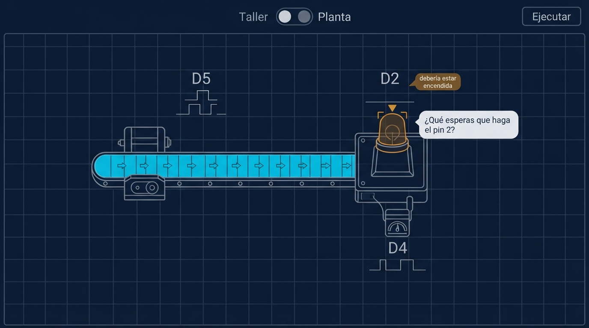{ width="49%" } 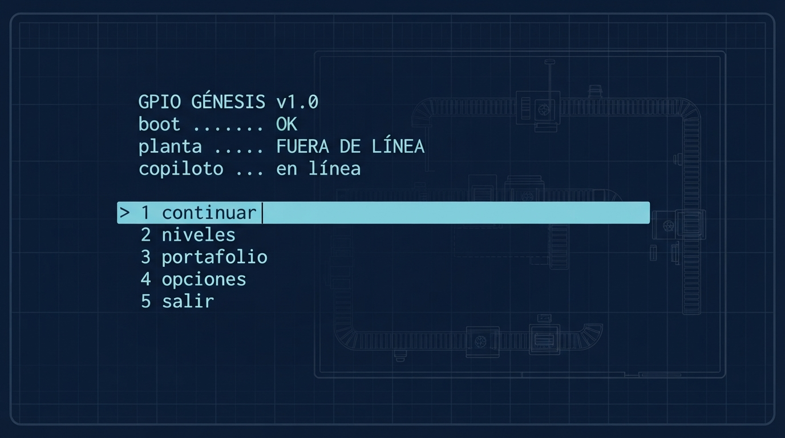{ width="49%" }

=== "C3 — Primer turno"

    **Combinación:** 1A pixel art · 2A lateral · 3B fábrica completa + editor deslizable · 4D capa de señales · 5B′ constantes en la plantilla · 6B personaje + 6D escalonado · 7E arranque al 90%

    **Primeros 30 s:** sin menú, la planta abre con "2 de 3 sistemas en línea" → la ingeniera dice que falta una línea → Tab abre el editor con el código casi completo → escribe `digitalWrite(MOTOR_BANDA, HIGH);` y ejecuta → "3 de 3 sistemas en línea".

    **Uso típico:** el resto del nivel pide cada vez un poco más; mantener Alt muestra el valor de cada pin; la ingeniera aparece cuando algo falla, empezando por una pregunta.

    **Analogía:** desfibrilador automático + tarjeta de sellos con progreso dotado + PACE.

    **Implicación de producción:** pixel art (~25 h) y personaje (~18 h); ~88 h en total.

    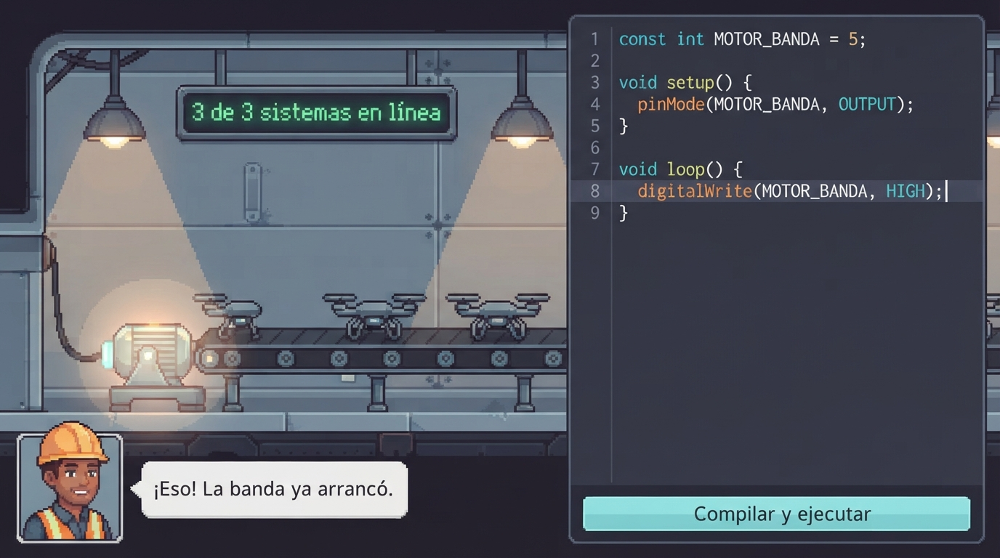{ width="49%" } 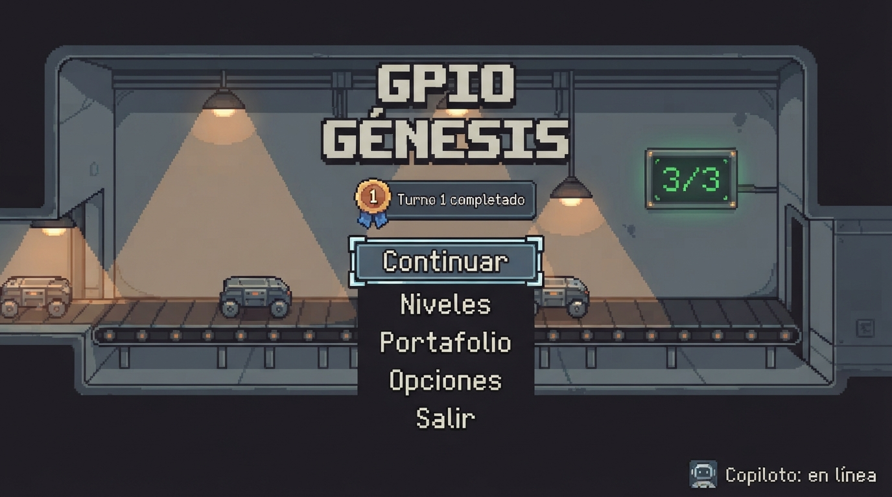{ width="49%" }

??? note "Prompt 3 que usamos"
    ```text
    Actúa como game designer y UX designer con experiencia en juegos indie de
    simulación y programación. Tu especialidad es articular conceptos de diseño
    completos — no solo cómo se ve el nivel, sino el sistema de tres
    componentes: el nivel (la fábrica), el menú + la interfaz del nivel, y la
    página de venta — de forma que cada componente refuerce la misma propuesta
    de valor y el mismo lenguaje visual.

    Nuestro producto: GPIO Génesis (100% digital, juego para PC con Godot 4)
    Propuesta de valor: "El único juego que convierte tu código C++ en
      portafolio real de automatización, para estudiantes de ingeniería que
      aprenden sin que se sienta como tarea."
    Usuario y contexto: estudiante de ingeniería de 18–25 años, juega Minecraft
      y simuladores, juega en su laptop en sesiones de 30–60 min, a veces sin
      internet; quiere que se sienta como pasatiempo; le motiva que C++ sirve
      para el trabajo.
    Contenido del nivel 1 (igual en los tres conceptos): "Arranque de línea"
      — motor de la banda (pin 5, salida), luz de la estación (pin 2, salida),
      sensor de presencia (pin 4, entrada, se usa en el nivel 2); setup/loop,
      pinMode, digitalWrite, delay; éxito = banda avanzando, luz encendida,
      5 chasis ensamblados; error típico = olvidar pinMode(5, OUTPUT).
    Contenido obligatorio del menú: Continuar, Nuevo juego, Niveles,
      Portafolio, Opciones, Cuenta (opcional), Salir + indicador del copiloto
      (en línea / sin conexión).

    Tabla morfológica final: [tabla del Prompt 1 + 5B′, 4D, 7D, 4E, 6D, 7E]

    CONCEPTO 1 — Planta en corte: 1B plano vectorial redondeado · 2A lateral
      en corte · 3A split fijo 60/40 · 4A LED + etiqueta · 5A pines impresos ·
      6A panel de chat · 7A menú clásico sobre la fábrica animada
    CONCEPTO 2 — Sala de control: 1C plano técnico (blueprint) · 2B cenital ·
      3C modos Taller / Planta · 4E planta en gris, color solo cuando importa
      · 5C resaltado cruzado · 6C anotaciones en contexto + 6D escalonado ·
      7B arranque tipo bootloader
    CONCEPTO 3 — Primer turno: 1A pixel art industrial · 2A lateral en corte
      · 3B fábrica completa + editor deslizable · 4D capa de señales (tecla)
      · 5B′ constantes en la plantilla · 6B personaje de planta + 6D
      escalonado · 7E arranque al 90%

    Para cada concepto desarrolla: NIVEL (primeros 30 s en ≤5 pasos, uso
    típico, principios activos), MENÚ + PANTALLA DEL NIVEL (menú, normal,
    alerta, acción principal, omisión deliberada) y LANDING PAGE (headline,
    visual, CTA). Formato de salida del curso + implicación de producción.
    ```

??? note "Salida completa del Prompt 3"
    ```text
    ════════════════════════════════════════════════════════
    CONCEPTO 1 — PLANTA EN CORTE (datum)
    Combinación morfológica: arte → plano vectorial redondeado · cámara →
      lateral en corte · pantalla → split fijo 60/40 · indicador → LED +
      etiqueta · código↔máquinas → pines impresos · copiloto → panel de chat ·
      menú → clásico sobre la fábrica animada
    ════════════════════════════════════════════════════════

    NIVEL
    Primeros 30 s:
      1. Abre el juego: el menú aparece sobre la planta trabajando de fondo;
         da clic en "Nuevo juego".
      2. Ve la planta detenida, en corte, a la izquierda; a la derecha el
         editor con setup() y loop() vacíos; el panel del copiloto dice
         "La banda está conectada al pin D5. Enciéndela."
      3. Lee la etiqueta D5 junto al motor y escribe pinMode y digitalWrite
         siguiendo el ejemplo del panel.
      4. Presiona "Compilar y ejecutar".
      5. El LED del motor se enciende, la banda avanza y llega el primer chasis.
    Uso típico: escribe a la derecha, ejecuta y mira la planta a la izquierda,
      sin cambiar de pantalla. Si algo falla, el LED de la máquina se queda
      apagado y el jugador abre el panel con "Pedir ayuda".
    Principios activos:
      · Affordances: la etiqueta D5 junto al conector dice qué número escribir.
      · Contour bias: paneles y máquinas con esquinas redondeadas; el rojo y
        las formas angulosas solo en errores.
      · Consistencia: un color por tipo de señal, igual en editor y LEDs.
      · Constraints: débil — solo impide ejecutar si no compila.
      · Confirmación: LED (menor) → contador de chasis + sonido (importante) →
        banner rojo de línea detenida (crítico).
      · Costo-beneficio: el más barato de los tres.

    MENÚ + PANTALLA DEL NIVEL
    Menú: título arriba a la izquierda y lista vertical; "Continuar" ("Nuevo
      juego" la primera vez) es el botón más grande; indicador del copiloto
      abajo.
    Normal: fábrica 60% a la izquierda con LEDs encendidos; editor 40% a la
      derecha; panel del copiloto colapsado bajo el editor.
    Alerta: error de compilación → línea subrayada y mensaje bajo el editor;
      watchdog → banner "La línea se detuvo: tu loop() nunca terminó";
      objetivo fallido → contador en rojo "2/5 chasis".
    Acción principal: "Compilar y ejecutar".
    Omisión deliberada: la consola serial no se muestra (es una pestaña); en
      el nivel 1 no se usa Serial y sería ruido.

    LANDING PAGE
    Headline: "Programa la fábrica. Aprende C++ de verdad."
    Visual principal: GIF de la planta en corte con el código al lado; al
      cambiar una línea, la banda reacciona.
    CTA: "Descarga la demo gratis"

    Implicación de producción principal: ninguna pieza cara; el riesgo es
      verse "genérico". ~67 h para nivel 1 + menú (suma de la tabla).

    ────────────────────────────────────────────────────────
    CONCEPTO 2 — SALA DE CONTROL
    Combinación morfológica: arte → plano técnico (blueprint) · cámara →
      cenital · pantalla → modos Taller / Planta · indicador → planta en gris,
      color solo cuando importa · código↔máquinas → resaltado cruzado ·
      copiloto → anotaciones en contexto, escalonado · menú → arranque tipo
      bootloader
    ════════════════════════════════════════════════════════

    NIVEL
    Primeros 30 s:
      1. Abre el juego: pantalla de arranque "GPIO GÉNESIS v1.0 — boot OK —
         planta: FUERA DE LÍNEA" con el cursor en "> iniciar"; presiona Enter
         (o da clic).
      2. Aparece el plano de la planta visto desde arriba en líneas blancas,
         todo en gris, salvo la banda marcada en ámbar: "debería avanzar".
      3. Da clic en la banda: cambia a modo Taller y el editor resalta dónde va
         el código de esa máquina (// motor de la banda: pin 5).
      4. Escribe su primera línea y presiona "Ejecutar": vuelve al modo Planta.
      5. La banda se rellena de color, la mini-traza del pin 5 sube a HIGH y el
         marcador ámbar desaparece.
    Uso típico: alterna entre Taller (escribir) y Planta (observar). Si todo
      va bien, la planta está tranquila y gris; si una máquina se marca en
      ámbar, un clic en ella lleva a sus líneas. Cuando la simulación se
      detiene, el copiloto deja una nota junto a la máquina y subraya la línea;
      cada "otra pista" sube un nivel de ayuda.
    Principios activos:
      · Affordances: clic en una máquina → sus líneas, y al revés.
      · Contour bias: en contra — el plano técnico es de líneas rectas y
        ángulos; hay que suavizar esquinas de los paneles para que no se sienta
        tenso todo el tiempo.
      · Consistencia: muy alta — todo el juego habla el lenguaje de un plano
        técnico y de una sala de control.
      · Constraints: en modo Planta no se edita; el menú se maneja con clic
        aunque parezca terminal.
      · Confirmación: la ausencia de marcadores = todo bien (cabina oscura);
        ámbar = desvío; rojo + nota = falla.
      · Ciclo de desarrollo: "todo gris = todo bien" no es obvio para un
        jugador nuevo; hay que probarlo con usuarios.

    MENÚ + PANTALLA DEL NIVEL
    Menú: pantalla de arranque tipo terminal; las opciones son comandos
      numerados ("1 continuar", "2 niveles", "3 portafolio"…) que también se
      pueden elegir con clic; "continuar" tiene el cursor por defecto. Estado
      del copiloto como línea del arranque ("copiloto: en línea").
    Normal: modo Planta — plano gris, señales activas en color, mini-traza bajo
      cada pin. Modo Taller — editor a pantalla completa con mini-vista.
    Alerta: máquina desviada en ámbar; error o watchdog en rojo con un ícono
      anguloso; nota del copiloto junto a la máquina y subrayado en la línea.
    Acción principal: el interruptor Taller / Planta y "Ejecutar".
    Omisión deliberada: en modo Planta no hay números de los pines, solo color
      y trazas — el jugador lee comportamiento, no valores. Tampoco hay
      historial de chat: la ayuda vive donde está el problema.

    LANDING PAGE
    Headline: "Tu código. Tu planta. Tu sala de control."
    Visual principal: el plano azul de la planta que se va coloreando máquina
      por máquina mientras corre el código.
    CTA: "Descarga la demo"

    Implicación de producción principal: el sistema de "estado esperado vs.
      real" (4E) y el resaltado cruzado (5C) dependen de que el validador y el
      análisis de llamadas al HAL funcionen bien. ~104 h para nivel 1 + menú —
      el más caro de los tres.

    ────────────────────────────────────────────────────────
    CONCEPTO 3 — PRIMER TURNO
    Combinación morfológica: arte → pixel art industrial · cámara → lateral en
      corte · pantalla → fábrica completa + editor deslizable · indicador →
      capa de señales con tecla · código↔máquinas → constantes en la plantilla
      · copiloto → personaje de planta, escalonado · menú → arranque al 90%
    ════════════════════════════════════════════════════════

    NIVEL
    Primeros 30 s:
      1. Abre el juego por primera vez: no hay menú; aparece la planta en pixel
         art con "2 de 3 sistemas en línea" (luces y ventilación funcionando)
         y la banda detenida.
      2. La ingeniera de planta dice en un globo: "Es tu primer turno. Falta
         una línea para arrancar la banda."
      3. Con Tab entra el editor desde la derecha: el código ya trae
         const int MOTOR_BANDA = 5; y pinMode; hay una línea vacía resaltada.
      4. Escribe digitalWrite(MOTOR_BANDA, HIGH); y presiona "Compilar y
         ejecutar", la única acción resaltada; el editor se vuelve
         semitransparente.
      5. La banda arranca, "3 de 3 sistemas en línea" y sale el primer chasis.
    Uso típico: el resto del nivel pide cada vez un poco más (encender la luz
      de la estación desde cero, con su propio pinMode). Mantener Alt muestra
      el valor de cada pin sobre su máquina. Si algo falla, la ingeniera
      aparece cuando la simulación se detiene, empezando por una pregunta.
    Principios activos:
      · Affordances: las constantes con nombre dicen qué controla cada pin.
      · Contour bias: pixel art de formas suaves y un personaje amable.
      · Constraints: el código prellenado evita errores de sintaxis en el
        primer minuto.
      · Confirmación: "x de 3 sistemas en línea" + sonido; la ingeniera solo
        aparece en el nivel crítico.
      · Costo-beneficio: el personaje cuesta ~18 h; se justifica solo si "que
        se sienta pasatiempo" pesa mucho en la matriz.
      · Ciclo de desarrollo: riesgo de que el personaje se sienta infantil
        para un universitario; probarlo.

    MENÚ + PANTALLA DEL NIVEL
    Menú: aparece al terminar el nivel 1; clásico sobre la planta en pixel art,
      con "Continuar" como acción dominante.
    Normal: planta a pantalla completa, editor oculto; la ingeniera, pequeña en
      una esquina.
    Alerta: la banda se detiene con una chispa y un sonido; la ingeniera
      aparece con un globo; al abrir el editor, la línea está marcada.
    Acción principal: Tab (abrir el editor) y "Compilar y ejecutar".
    Omisión deliberada: no hay HUD de pines permanente (solo con Alt) y el
      botón de ayuda aparece hasta el primer fallo — la planta es la
      protagonista para que no se sienta como un IDE.

    LANDING PAGE
    Headline: "Tu primer turno en la fábrica de drones empieza con una línea
      de C++."
    Visual principal: GIF en pixel art: alguien escribe una línea y la banda
      arranca.
    CTA: "Juega tu primer turno gratis"

    Implicación de producción principal: el pixel art (~25 h) y el personaje
      (~18 h). ~88 h para nivel 1 + menú.
    ════════════════════════════════════════════════════════
    ```

---

## 4. Renders y evaluación (Prompt 4)

Generamos las 6 imágenes (menú y nivel 1 de cada concepto) con Google AI Studio. El objetivo no era que se vieran bonitas, sino ver si cada pantalla comunica lo que debe antes de invertir horas en Godot.

??? note "Prompt 4 que usamos (versión solo Google)"
    ```text
    Actúa como director de arte con experiencia en escribir prompts para
    herramientas de IA generativa de imagen aplicadas a concept art de
    videojuegos y mockups de interfaz. Usaremos solo Google (Nano Banana /
    Imagen en Google AI Studio): responde mejor a lenguaje descriptivo fluido
    en párrafos cortos, es fiel al texto, puede escribir etiquetas cortas
    legibles y se puede corregir la imagen con instrucciones de seguimiento.

    El objetivo NO es espectáculo visual: es hacer visible la dirección de
    diseño de dos pantallas (menú principal y nivel 1) de cada uno de
    nuestros 3 conceptos para evaluarla antes de invertir horas en Godot.
    Son capturas de pantalla simuladas de un juego 2D para PC, en 16:9.

    [Información del equipo: perfil del jugador (semana 4), los 3 conceptos
     del Prompt 3 con su combination morfológica, contenido del menú y del
     nivel 1, principios de diseño activos, restricciones de la semana 5:
     alcanzable en Godot 4 2D por 2 personas, legible en 1366×768, interfaz
     en español, palabras de C++ en inglés.]

    Genera, para cada concepto: prompt del MENÚ, prompt del NIVEL 1, por qué
    funcionan en Google, una instrucción de seguimiento sugerida; y al final
    QUÉ EVALUAR EN LOS RENDERS (3 preguntas).
    ```

??? note "Los 6 prompts de imagen que generó (listos para Google AI Studio)"
    ```text
    ════════════════════════════════════════════════════════
    C1 — PLANTA EN CORTE · MENÚ PRINCIPAL
    ════════════════════════════════════════════════════════
    ```

    ```text
    A 16:9 screenshot of the main menu of a 2D PC indie game about a drone
    factory. Flat vector art style with rounded corners everywhere, clean
    shapes, no textures, soft shadows. Dark charcoal background (#161B22) with
    a few bright accent colors.

    The background shows a side-view cutaway of a small factory, like a
    diorama: a conveyor belt moving left to right carrying simple drone
    chassis, a robotic arm and an assembly station. Each machine has a small
    round green LED. The factory is slightly dimmed and blurred so the menu
    reads clearly.

    On the left third, a vertical menu. At the top, the title "GPIO GÉNESIS" in
    a bold geometric sans-serif. Below it, five rounded buttons stacked
    vertically: "Continuar" (the largest, filled in bright green), then
    "Niveles", "Portafolio", "Opciones" and "Salir" as smaller outlined
    buttons. In the bottom-left corner, a small green dot with the text
    "Copiloto: en línea".

    Only that text, spelled exactly as written. No other words, no logos, no
    people, no 3D realistic rendering. It must look buildable by a small team
    in a 2D game engine.
    ```

    ```text
    ════════════════════════════════════════════════════════
    C1 — PLANTA EN CORTE · NIVEL 1
    ════════════════════════════════════════════════════════
    ```

    ```text
    A 16:9 gameplay screenshot of a 2D PC programming game set in a drone
    factory. Flat vector art with rounded corners, dark charcoal UI
    (#161B22), clean and readable like a modern code editor mixed with a
    cozy simulation game.

    The screen is split in two. The left 60% shows a side-view cutaway of
    the factory: a conveyor belt moving left to right with three simple drone
    chassis on it, an electric motor at the left end of the belt and an
    assembly station at the right end with a lamp. Next to the motor there is
    a small rounded tag "D5" and a glowing green LED; next to the lamp, a tag
    "D2" with a glowing green LED; next to a small sensor at the station, a
    tag "D4" with a grey LED. At the top left, a counter "Chasis: 3/5".

    The right 40% is a code editor with line numbers and syntax highlighting
    on a dark background, showing exactly this C++ code in a monospace font:
    void setup() {
      pinMode(5, OUTPUT);
    }
    void loop() {
      digitalWrite(5, HIGH);
    }
    Above the editor, a rounded green button "Compilar y ejecutar". Below the
    editor, a thin collapsed panel with a small chat icon and the text
    "Copiloto · Pedir ayuda".

    No people, no extra text, no 3D realistic rendering, no clutter. Every
    label must be large and legible.
    ```

    ```text
    ════════════════════════════════════════════════════════
    C2 — SALA DE CONTROL · MENÚ PRINCIPAL
    ════════════════════════════════════════════════════════
    ```

    ```text
    A 16:9 screenshot of the main menu of a 2D PC indie game, designed as the
    boot screen of a microcontroller in an industrial control room. Deep
    navy blue background (#0B1E3A) with a faint technical blueprint grid. In
    the background, very faint white line drawings of a factory floor plan
    seen from above (conveyor belts, machines), like an engineering drawing.

    In the center-left, monospace text in white and light cyan, like a
    terminal, line by line:
    "GPIO GÉNESIS v1.0"
    "boot ........ OK"
    "planta ...... FUERA DE LÍNEA"
    "copiloto .... en línea"
    Then a menu of numbered commands:
    "> 1 continuar" (highlighted with a cyan bar and a blinking cursor)
    "  2 niveles"
    "  3 portafolio"
    "  4 opciones"
    "  5 salir"

    Panels have slightly rounded corners. Calm, precise, professional mood.
    Only that text, spelled exactly as written. No people, no 3D, no logos,
    no extra words.
    ```

    ```text
    ════════════════════════════════════════════════════════
    C2 — SALA DE CONTROL · NIVEL 1
    ════════════════════════════════════════════════════════
    ```

    ```text
    A 16:9 gameplay screenshot of a 2D PC programming game styled like an
    industrial control room display (high-performance HMI). Top-down view of a
    small drone factory drawn as a technical blueprint: thin white lines on a
    deep navy background (#0B1E3A) with a faint grid.

    Almost everything is calm grey line art. Only two things have color: the
    conveyor belt is filled in bright cyan with small arrows showing it is
    moving, and the assembly station lamp is outlined with an amber marker
    and a small amber tag "debería estar encendida". Each machine has a thin
    label with its pin: "D5" on the belt motor, "D2" on the station lamp,
    "D4" on the sensor. Under each label, a tiny timeline trace like a logic
    analyzer: the D5 trace is high, the D2 trace is flat low.

    At the top center, a two-position toggle switch with the labels "Taller"
    and "Planta", set to "Planta". At the top right, a button "Ejecutar".
    Next to the amber lamp, a small rounded note from an assistant: "¿Qué
    esperas que haga el pin 2?"

    No code editor in this view, no people, no 3D, no extra text. The screen
    must feel calm, with color only where it matters.
    ```

    ```text
    ════════════════════════════════════════════════════════
    C3 — PRIMER TURNO · MENÚ PRINCIPAL
    ════════════════════════════════════════════════════════
    ```

    ```text
    A 16:9 screenshot of the main menu of a 2D pixel art PC indie game about
    a drone factory, shown after the player finished the first level. Crisp
    pixel art at low resolution scaled up, limited palette of steel greys and
    warm industrial lights, soft rounded pixel shapes.

    The background is a side-view cutaway of the factory at the end of a
    shift: the conveyor belt running with drone chassis, warm lamps on, a
    small "3/3" status board glowing green on the wall.

    In the center, the title "GPIO GÉNESIS" in a chunky pixel font. Below it,
    a small badge "Turno 1 completado". Then a vertical menu in a pixel font:
    "Continuar" (largest, highlighted with a bright frame), "Niveles",
    "Portafolio", "Opciones", "Salir". In the bottom-right corner, a small
    icon with the text "Copiloto: en línea".

    Only that text, spelled exactly as written. No people in the menu, no 3D,
    no logos, no extra words. It must look achievable with pixel art tiles.
    ```

    ```text
    ════════════════════════════════════════════════════════
    C3 — PRIMER TURNO · NIVEL 1
    ════════════════════════════════════════════════════════
    ```

    ```text
    A 16:9 gameplay screenshot of a 2D pixel art PC programming game set in a
    drone factory, at the exact moment the player's first line of code works.
    Crisp pixel art, steel greys and warm lights, soft rounded shapes.

    The factory fills the whole screen in a side-view cutaway: a conveyor
    belt just starting to move with drone chassis, the electric motor
    glowing, lamps on. A status board on the wall reads "3 de 3 sistemas en
    línea" in green.

    From the right side, a semi-transparent code editor panel covers about
    45% of the screen, with line numbers and syntax highlighting, showing
    exactly this C++ code in a monospace font:
    const int MOTOR_BANDA = 5;
    void setup() {
      pinMode(MOTOR_BANDA, OUTPUT);
    }
    void loop() {
      digitalWrite(MOTOR_BANDA, HIGH);
    }
    The last line is highlighted as just written. Below the code, one
    highlighted button "Compilar y ejecutar".

    In the bottom-left corner, a small friendly pixel art portrait of a plant
    engineer wearing a hard hat and safety vest, with a speech bubble:
    "¡Eso! La banda ya arrancó."

    No other characters, no 3D, no extra text. Every label must be legible.
    ```

    ```text
    ────────────────────────────────────────────────────────
    POR QUÉ FUNCIONAN EN GOOGLE
    ────────────────────────────────────────────────────────
    Cada prompt describe la pantalla de afuera hacia adentro (estilo → zonas
    con porcentaje → elementos → texto exacto → restricciones), que es como
    Google sigue mejor un layout. Al darle el código y las etiquetas literales
    y prohibir "texto extra", se reduce que invente palabras, y al pedir que
    "se vea construible en un motor 2D" se frena el realismo 3D que no podemos
    producir.

    ────────────────────────────────────────────────────────
    INSTRUCCIONES DE SEGUIMIENTO SUGERIDAS (para corregir sin regenerar)
    ────────────────────────────────────────────────────────
    · "Make the pin labels D2, D4 and D5 twice as large."
    · "Fix the title so it reads exactly GPIO GÉNESIS, with the accent on the É."
    · "Remove any extra text that is not in my prompt."
    · C2: "Make everything grey except the cyan belt and the amber lamp marker."
    · C3: "Make the engineer portrait smaller and less cartoonish, more like a
        young professional."

    ════════════════════════════════════════════════════════
    QUÉ EVALUAR EN LOS RENDERS
    ════════════════════════════════════════════════════════
    1. Affordances: sin leer nada más, ¿se entiende qué pin mueve qué máquina
       y cuál es el botón para ejecutar?
    2. Confirmación: ¿se distingue a primera vista que la banda está
       funcionando (y, en C2, qué máquina NO está como debe)?
    3. Contour bias y tono: ¿la pantalla se siente como un juego al que
       quieres volver (curvas, calidez) o como una clase / un IDE (tensión,
       frialdad)? ¿El menú tiene UNA acción dominante?
    ════════════════════════════════════════════════════════
    ```

**Evaluación del equipo:**

| Imagen | ¿Se entiende qué pin mueve qué máquina? | ¿Se ve el estado de un vistazo? | ¿Se siente juego o clase? |
|---|---|---|---|
| C1 nivel | **Sí — el más claro** (etiquetas junto a cada máquina) | **Sí — el más claro** | Entre juego y herramienta |
| C2 nivel | Más o menos (etiquetas lejos de las máquinas) | Más o menos ("todo gris" no se lee como "todo bien") | Clase / diagrama — **el que menos gustó** |
| C3 nivel | Más o menos (el motor no tiene etiqueta) | Sí, después de C1 | **Juego — el que más gustó** |

**Lo que notamos de las imágenes (y que no debemos copiar):** en C1 la lámpara D2 aparece encendida aunque el código solo enciende el pin 5; el ícono del copiloto en C1 se parece al logo de Microsoft Copilot; en C2 la traza de D5 salió como pulso aunque el pin está en HIGH; en el menú de C3 los chasis parecen camionetas. Las IA de imagen sirven para decidir estilo y sensación, no para la maqueta final.

!!! warning "Límite de la evidencia"
    La evaluación la hicimos nosotros dos. Falta enseñar las imágenes a 3–4 personas del segmento; además de reforzar la deseabilidad, eso validaría el tema "fábrica de drones", que sigue siendo hipótesis desde la semana 4.

---

## 5. Matriz de Pugh (Prompt 5)

[📊 Matriz en Excel con fórmulas](../recursos/archivos/pugh-gpio-genesis.xlsx) (pestañas: Matriz de Pugh, Evaluación renders, Ronda 2).

**Criterios y pesos** (definidos antes de evaluar). Deseabilidad = **55%** (regla: ≥ 40%).

| ID | Criterio | Tipo | Peso | Descripción |
|---|---|---|---|---|
| D1 | Pin ↔ máquina legible | Deseabilidad | 15% | Sin leer el tutorial, se entiende qué pin mueve qué máquina |
| D2 | Estado visible de un vistazo | Deseabilidad | 15% | Se distingue si la planta funciona y qué máquina falla |
| D3 | Se siente juego, no clase | Deseabilidad | 15% | Atractivo para un jugador de Minecraft/simuladores |
| D4 | Primeros 30 s sin instrucciones | Deseabilidad | 10% | Llegar a la primera compilación que mueve algo sin ayuda (RI-01) |
| F1 | Horas de producción | Factibilidad | 15% | Horas-persona para nivel 1 + menú |
| F2 | Riesgo técnico en Godot 4 | Factibilidad | 10% | Dependencia de sistemas difíciles |
| F3 | Assets con licencia compatible | Factibilidad | 10% | Conseguir o hacer arte CC0/MIT/OFL coherente |
| F4 | Escalabilidad a 5 niveles | Factibilidad | 10% | Costo de agregar una máquina o nivel |

**Ronda 1 — contra el datum C1:**

| Criterio (peso) | C2 — Sala de control | C3 — Primer turno | C1 — datum |
|---|:---:|:---:|:---:|
| D1 Pin ↔ máquina (15%) | – | – | datum |
| D2 Estado visible (15%) | – | – | datum |
| D3 Juego, no clase (15%) | – | + | datum |
| D4 Primeros 30 s (10%) | – | + | datum |
| F1 Horas (15%) | – | – | datum |
| F2 Riesgo técnico (10%) | – | S | datum |
| F3 Assets (10%) | + | – | datum |
| F4 Escalabilidad (10%) | + | – | datum |
| **Puntuación** | **–60** | **–40** | **0** |

Ganó el datum (C1): es el más claro en lo que más pesa para el jugador y el más barato de producir y escalar. **Sensibilidad:** aun si a C3 le agregamos etiquetas de pin (D1 y D2 pasan a S), sube a –10 y sigue perdiendo; C3 pierde por factibilidad, no por deseabilidad.

**Riesgo principal del ganador:** D3 "se siente juego, no clase" (15%), justo lo que el segmento pidió en las entrevistas. **Iteración recomendada:** adoptar atributos de C3 y C2 en el ganador.

**Ronda 2 — decisión del equipo.** Los dos coincidimos en que el estilo gráfico de C3 es el mejor y las funciones de C1 son las mejores. Evaluamos esa combinación contra el mismo datum, con los mismos pesos:

| Criterio | Concepto final vs. C1 | Por qué |
|---|:---:|---|
| D1 Pin ↔ máquina | S | Mismas etiquetas, ahora con el nombre de la constante |
| D2 Estado visible | + | LEDs + mini-trazas + marcador de desviación + objetivos con palomita |
| D3 Juego, no clase | + | Estilo de C3 |
| D4 Primeros 30 s | + | Arranque al 90% |
| F1 Horas | – | ~95 h vs. ~67 h |
| F2 Riesgo técnico | S | El marcador reutiliza el validador del nivel (RF-03) |
| F3 Assets | – | Pixel art coherente requiere más arte a mano |
| F4 Escalabilidad | – | Cada máquina nueva necesita sprite propio |
| **Puntuación** | **+5** | Supera al datum, con margen pequeño |

!!! info "Costo-beneficio: decisión consciente"
    Sabemos que el pixel art cuesta ~28 h más que el vectorial y escala peor (F1, F3 y F4 en contra). Lo elegimos porque "se siente juego, no clase" pesa 15% y es lo que el segmento pidió. Mitigación: paleta de 16 colores, una sola hoja de sprites de máquinas de 32×32, base de assets CC0 retocada y un **tope de 30 h de arte para el nivel 1**; si se pasa, las máquinas de los niveles 4–5 se reutilizan recoloreadas. Lo revisamos en la semana 8.

??? note "Prompt 5 que usamos"
    ```text
    Actúa como ingeniero de producto con experiencia en selección de concepto
    usando la Matriz de Pugh para productos de software y videojuegos en etapa
    de prototipo temprano. Tu metodología asegura que los criterios representen
    tanto la perspectiva del jugador (deseabilidad) como la del equipo de
    desarrollo (factibilidad), con peso explícito para cada uno. No permites
    que la matriz esté dominada por criterios técnicos cuando el producto va
    dirigido a un estudiante que quiere que aprender se sienta como jugar.

    Somos un equipo de ingeniería en México (2 personas). Producto: GPIO
    Génesis, videojuego 100% digital para PC (Godot 4) donde se programa en C++
    real una fábrica de drones, con copiloto IA. Tenemos 3 conceptos de diseño:

    CONCEPTO 1 — Planta en corte: fábrica en corte lateral con estilo
      vectorial redondeado, pantalla dividida con el editor siempre visible,
      LEDs y etiquetas de pin en cada máquina, copiloto en un panel de chat.
      Es el más convencional: ES EL DATUM.
    CONCEPTO 2 — Sala de control: plano técnico visto desde arriba donde todo
      está en gris salvo lo que importa, modos Taller/Planta, notas del
      copiloto junto a la máquina, arranque tipo microcontrolador.
    CONCEPTO 3 — Primer turno: pixel art en corte lateral, editor deslizable,
      arranque al 90% con una ingeniera de planta que guía con preguntas.

    Nuestro jugador: estudiante de ingeniería de 18–25 años, juega Minecraft y
      simuladores en su laptop; le importa que los primeros minutos no se
      sientan como clase, entender qué hace su código sin leer manuales, y que
      lo que aprende sirva para su portafolio.

    Evidencia que tenemos: evaluación de los 6 renders por el equipo (C3 el
      que más gustó; C1 el más claro en qué pin mueve qué máquina y en el
      estado; C2 el que menos gustó).

    Nuestras restricciones de producción:
    · Proceso disponible: Godot 4 (lo estamos aprendiendo) + assets CC0/MIT/OFL
    · Presupuesto: 2 personas, ~7 semanas hasta la semana 13, $0 en assets
    · Volumen objetivo: 20 jugadores en el piloto; PC mínima Core i3, 8 GB,
      gráficos integrados, Windows 10

    Construye la Matriz de Pugh: 1) 8–10 criterios (mínimo 3 de deseabilidad
    y 3 de factibilidad, deseabilidad ≥ 40% del peso, pesos que sumen 100);
    2) evalúa C2 y C3 contra el datum con +, –, S y justifica las no obvias;
    3) puntuación ponderada; 4) análisis: ganador, riesgo principal e
    iteración recomendada. Formato MATRIZ DE PUGH del curso.
    ```

??? note "Salida completa del Prompt 5"
    ```text
    ════════════════════════════════════════════════════════
    MATRIZ DE PUGH
    Datum: C1 — Planta en corte
    ════════════════════════════════════════════════════════

    CRITERIOS Y PESOS:

    DESEABILIDAD (peso total: 55%)
    · D1 Pin ↔ máquina legible (15%): sin leer el tutorial, se entiende qué
      pin mueve qué máquina.
    · D2 Estado visible de un vistazo (15%): se distingue si la planta
      funciona y qué máquina falla, sin abrir la consola.
    · D3 Se siente juego, no clase (15%): atractivo para un jugador de
      Minecraft/simuladores; ganas de volver.
    · D4 Primeros 30 s sin instrucciones (10%): llegar a la primera
      compilación que mueve algo sin ayuda (RI-01).

    FACTIBILIDAD (peso total: 45%)
    · F1 Horas de producción (15%): horas-persona para nivel 1 + menú.
    · F2 Riesgo técnico en Godot 4 (10%): dependencia de sistemas difíciles.
    · F3 Assets con licencia compatible (10%): conseguir o hacer arte
      CC0/MIT/OFL coherente.
    · F4 Escalabilidad a 5 niveles (10%): costo de agregar una máquina o nivel.

    (Rendimiento en la PC mínima no se incluye: los tres son 2D y empatarían.)

    ────────────────────────────────────────────────────────
    MATRIZ DE EVALUACIÓN:

    | Criterio (peso)            | C2 — Sala de control | C3 — Primer turno | C1 — datum |
    |----------------------------|:--------------------:|:-----------------:|:----------:|
    | D1 Pin ↔ máquina (15%)     | –                    | –                 | datum      |
    | D2 Estado visible (15%)    | –                    | –                 | datum      |
    | D3 Juego, no clase (15%)   | –                    | +                 | datum      |
    | D4 Primeros 30 s (10%)     | –                    | +                 | datum      |
    | F1 Horas (15%)             | –                    | –                 | datum      |
    | F2 Riesgo técnico (10%)    | –                    | S                 | datum      |
    | F3 Assets (10%)            | +                    | –                 | datum      |
    | F4 Escalabilidad (10%)     | +                    | –                 | datum      |

    Justificación de las evaluaciones no obvias:
    · C2 D2 –: "todo gris = todo bien" no se leyó así en el render.
    · C2 F3/F4 +: el plano técnico se dibuja con líneas; una máquina nueva es
      un dibujo, no un sprite.
    · C3 D1 –: el motor no tiene etiqueta; MOTOR_BANDA solo vive en el código.
    · C3 D4 +: arranque al 90% = una línea y una sola acción resaltada.
    · C3 F3/F4 –: un set de pixel art coherente (drones, máquinas, retrato) no
      se arma solo con paquetes CC0; cada máquina nueva pide sprites propios.

    Puntuación ponderada:
    C1 (datum): 0 · C2: –60 · C3: –40

    Sensibilidad: si a C3 se le agregan etiquetas de pin (D1 y D2 pasan a S),
    C3 sube a –10 y el datum sigue ganando. C3 pierde por factibilidad
    (horas, assets, escalabilidad), no por deseabilidad.

    ────────────────────────────────────────────────────────
    CONCEPTO GANADOR: C1 — Planta en corte
    Por qué ganó: es el más claro en lo que más pesa para el jugador (qué pin
    mueve qué máquina y cómo está la planta) y el más barato de producir y de
    escalar a 5 niveles. C3 le gana en atractivo y en los primeros 30 s, pero
    cuesta ~21 h más y su arte no escala.

    RIESGO PRINCIPAL: D3 "se siente juego, no clase" (15%). Es donde el ganador
    es más débil: el render de C1 se ve entre juego y herramienta, y es
    justo lo que el segmento pidió en las entrevistas ("como pasatiempo, no
    como clase"). Mitigación: adoptar la calidez de C3 (luces cálidas,
    progreso "x de 3 sistemas", copiloto con voz de persona) sin cambiar a
    pixel art, y probarlo con 3–4 personas del segmento.

    ITERACIÓN RECOMENDADA — "C1+":
    · De C3: arranque al 90% (7E), constantes en la plantilla (5B′) PERO con
      la etiqueta en la máquina ("D5 · MOTOR_BANDA"), tablero "x de 3
      sistemas en línea", copiloto escalonado (6D) y luces cálidas.
    · De C2: la mini-traza bajo cada pin (para ver el efecto de delay()) y el
      marcador ámbar en la máquina que no hace lo que pide el nivel.
    · Costo extra estimado: ~+20 h sobre C1 (≈ 87 h), similar a C3 pero con
      arte vectorial que sí escala.
    ════════════════════════════════════════════════════════
    ```

---

## 6. Concepto final — "Primer turno" (arte de C3 + funciones de C1)

| Parámetro | Elección | Viene de |
|---|---|---|
| Dirección de arte | Pixel art industrial, paleta limitada, luces cálidas | C3 |
| Cámara | Lateral en corte | C1 = C3 |
| Distribución | Pantalla dividida: fábrica + editor siempre visible; copiloto bajo el editor | C1 |
| Indicador de estado | LED + etiqueta en cada máquina, mini-trazas por pin y marcador naranja en la máquina que no cumple el objetivo | C1 + C2 |
| Código ↔ máquinas | Etiqueta con el mismo nombre que la constante del código (`D5 · MOTOR_BANDA`) | C1 + C3 |
| Copiloto | Panel con retrato de la ingeniera y ayuda escalonada en 4 niveles | C1 + C3 + C2 |
| Menú y primeros 30 s | Arranque al 90% la primera vez; menú clásico desde el segundo arranque | C3 + C1 |

---

## 7. Boceto técnico (versión 2)

[📐 Boceto editable en draw.io](../recursos/archivos/boceto-tecnico-gpio-genesis.drawio) (6 páginas; se abre en [diagrams.net](https://app.diagrams.net) con *Archivo → Abrir desde → Dispositivo*). Clic en cada imagen para verla en tamaño completo.

### 7.1 Nivel 1 — estado normal

[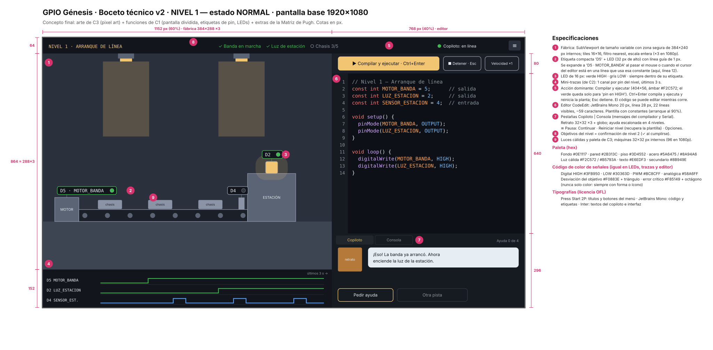](../recursos/imgs/boceto-nivel1-normal.svg)

### 7.2 Distribución adaptable (4 resoluciones)

[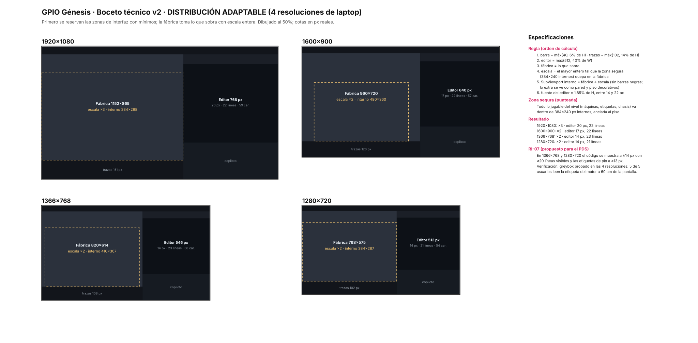](../recursos/imgs/boceto-resoluciones.svg)

### 7.3 Capas de la escena (nuestra "sección transversal")

[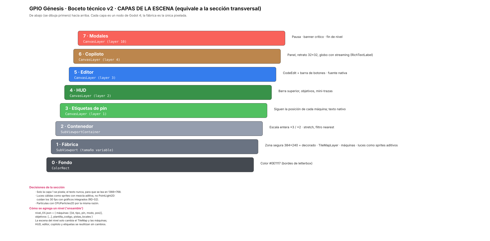](../recursos/imgs/boceto-capas.svg)

### 7.4 Ficha técnica

| Decisión | Valor |
|---|---|
| Resolución base | 1920×1080; fábrica 60% / editor 40% |
| Fábrica | SubViewport de tamaño variable, **zona segura 384×240 px internos**, tiles 16×16, máquinas 32×32, filtro nearest |
| Escalado | Entero (el mayor que quepa): ×3 en 1920×1080, ×2 en 1600×900, 1366×768 y 1280×720 |
| Etiquetas de pin | Compactas (`D5` + LED, 32 px de alto, línea guía); se expanden a `D5 · MOTOR_BANDA` con el mouse o con el cursor del editor |
| Editor | CodeEdit, JetBrains Mono 20 px en 1080p (mínimo 14 px), ≥ 21 líneas visibles en todas las resoluciones |
| Acción dominante | "Compilar y ejecutar" (ámbar `#F2C572`, Ctrl+Enter); reinicia la planta. Esc detiene |
| Copiloto | Pestañas Copiloto / Consola; retrato 32×32 ×3; 4 niveles de ayuda (1–2 locales, 3–4 nube) |
| Señales | Digital HIGH `#3FB950` / LOW `#30363D` · PWM `#BC8CFF` · analógica `#58A6FF` |
| Alertas | Desviación `#F0883E` + triángulo · crítico `#F85149` + octágono (nunca solo color) |
| Tipografías (OFL) | Press Start 2P (títulos y menú), JetBrains Mono (código y etiquetas), Inter (textos) |
| Rendimiento | Luces como sprites aditivos y CPUParticles2D (gráficos integrados, RD-02) |
| Cómo se agrega un nivel | `nivel_XX.json` (máquinas, objetivos, plantilla de código, pistas locales) + escena con TileMap; HUD, editor y copiloto se reutilizan |

**Requerimiento nuevo para el PDS — RI-07:** en 1366×768 y 1280×720 el código se muestra a ≥ 14 px con ≥ 20 líneas visibles y las etiquetas de pin a ≥ 13 px. *Verificación:* greybox probado en las 4 resoluciones; 5 de 5 usuarios leen la etiqueta del motor a 60 cm de la pantalla.

---

## 8. Wireframe de la "app": menú, alerta y primeros pasos

### 8.1 Menú principal

[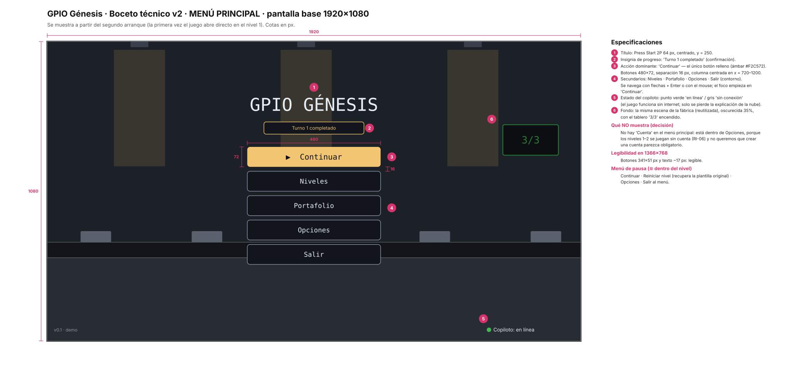](../recursos/imgs/boceto-menu.svg)

### 8.2 Nivel 1 — estado de alerta

El jugador escribió `digitalWrite(LUZ_ESTACION, HIGH)` pero olvidó `pinMode(LUZ_ESTACION, OUTPUT)`: solo la lámpara se marca, su traza se queda abajo y el copiloto pregunta en lugar de dar la respuesta.

[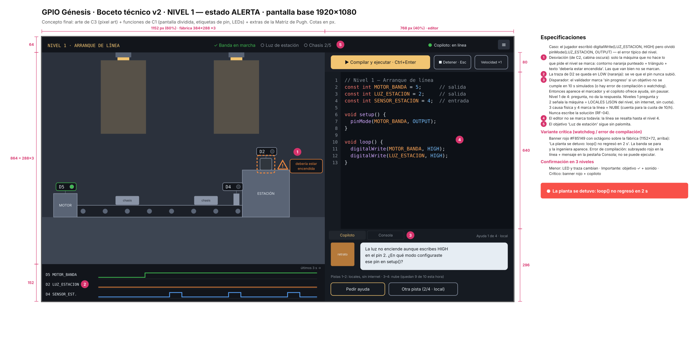](../recursos/imgs/boceto-nivel1-alerta.svg)

### 8.3 Flujo de primera vez (primeros 3 pasos)

[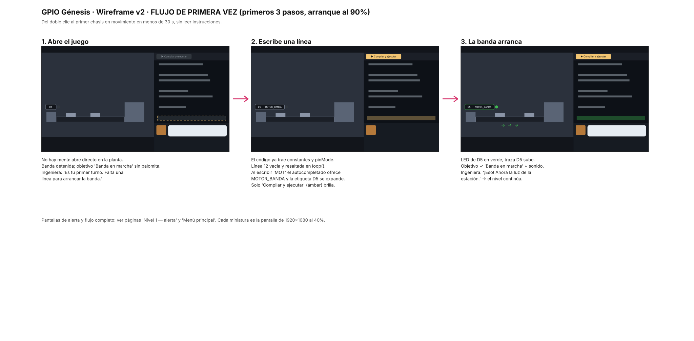](../recursos/imgs/wireframe-primera-vez.svg)

---

## 9. Crítica del boceto (Prompt 6) y versión 2

La primera versión del boceto salió **"lista para greybox con ajustes menores"**. Aceptamos los tres problemas críticos y respondimos las preguntas abiertas:

| Problema de la v1 | Qué cambiamos en la v2 |
|---|---|
| Las etiquetas de pin (270–330 px) no escalan a 6–8 máquinas | Etiqueta compacta por defecto (`D5` + LED) con línea guía; se expande con el mouse o con el cursor del editor. Regla: una etiqueta por cada 64 px de fábrica |
| La escala entera solo cuadraba en 1920×1080 y 1366×768 | Primero se reservan mínimos de interfaz y la fábrica toma el resto; zona segura de 384×240; probado en 4 resoluciones |
| No estaba definido cuándo habla el copiloto ni cuánto cuesta cada pista | Disparador: un objetivo sin cumplirse en 10 s simulados (o error / watchdog). Pistas 1–2 locales y gratis; 3–4 en la nube, con las consultas restantes a la vista |
| ¿Se edita mientras corre? | Sí; "Compilar y ejecutar" reinicia la planta |
| ¿Dónde van el compilador y `Serial`? | Pestaña "Consola" junto al copiloto |
| ¿Atajos? | Ctrl+Enter compila y ejecuta; Esc detiene |
| ¿El verde del botón es el de HIGH? | Ya no: el botón pasó a ámbar; el verde solo significa "pin en HIGH" |
| ¿Cómo se reinicia el nivel? | "Reiniciar nivel" en el menú de pausa (recupera la plantilla) |

**Fortaleza que no cambiamos:** una sola fuente de verdad para cada señal — el mismo nombre y el mismo color en el código, la etiqueta, el LED y la traza — y la fábrica pixelada separada del texto nativo.

??? note "Prompt 6 que usamos"
    ```text
    Actúa como diseñador de UI de videojuegos y programador de Godot con
    experiencia en revisar maquetas de pantalla antes del greybox. Tu
    especialidad es identificar decisiones que van a generar problemas de
    legibilidad, de rendimiento, de producción o de escalado a más niveles —
    antes de que aparezcan en el motor. Eres directo: señalas el problema y
    propones la solución específica. No corriges todo — priorizas los 3
    problemas más importantes.

    Somos un equipo de ingeniería en México (2 personas, Godot 4, ~7 semanas).
    Elegimos el siguiente concepto con la Matriz de Pugh y hicimos la primera
    maqueta técnica. Necesitamos crítica antes de construir el greybox.

    Concepto elegido: Primer turno (arte de C3 + funciones de C1)
    Descripción: juego de PC en pixel art donde el jugador programa en C++ una
      fábrica de drones vista en corte lateral; la pantalla está dividida
      entre la fábrica y el editor, y una ingeniera de planta (copiloto IA)
      ayuda con pistas escalonadas.
    Jugador y contexto: estudiante de ingeniería de 18–25 años, laptop de
      14–15" (1366×768 a 1920×1080), gráficos integrados, sesiones de 30–60 min.

    Descripción de la maqueta del NIVEL 1:
    · Base 1920×1080. Barra superior 64 px (nivel, objetivos con palomita,
      estado del copiloto, pausa). Fábrica 1152×864 a la izquierda (60%):
      SubViewport de 384×288 px internos, tiles 16×16, máquinas 32×32, filtro
      nearest, escala entera ×3. Debajo, franja de mini-trazas de 152 px con
      un canal por pin del nivel (últimos 3 s). Columna derecha 768 px (40%):
      barra de botones 80 px ("Compilar y ejecutar" 360×56 verde, Detener,
      Velocidad), editor CodeEdit 640 px (JetBrains Mono 20 px, línea 28 px,
      ~22 líneas), panel del copiloto 296 px (retrato 32×32 ×3, globo, botones
      "Pedir ayuda" y "Otra pista").
    · Máquinas del nivel 1: motor de la banda (D5), lámpara de la estación
      (D2), sensor de presencia (D4). Cada una con etiqueta a resolución
      nativa "D5 · MOTOR_BANDA" (JetBrains Mono 18 px, 40 px de alto, 270–330
      px de ancho) y LED de 18 px.
    · Colores de señal: HIGH #3FB950, LOW #30363D, PWM #BC8CFF, analógica
      #58A6FF; desviación #F0883E + triángulo; crítico #F85149 + octágono.
      Paleta de 16 colores; luces cálidas como sprites aditivos.
    · Capas: ColorRect fondo → SubViewport fábrica → SubViewportContainer
      (escala entera) → CanvasLayer etiquetas → HUD → editor → copiloto →
      modales.
    · Alerta: la máquina que no cumple el objetivo se marca con contorno
      naranja punteado, triángulo y texto "debería estar encendida"; su traza
      se queda en LOW; el copiloto, nivel 1 de 4, hace una pregunta; solo
      habla cuando la simulación se detiene. Crítico: banner rojo sobre la
      fábrica ("loop() no regresó en 2 s").
    · En 1366×768 la fábrica baja a ×2 (768×576), el editor se queda con 598
      px (14 px, ~24 líneas). Barra 46 px, trazas 146 px.

    Descripción del MENÚ y del flujo de primera vez:
    · Menú (desde el segundo arranque): fábrica de fondo oscurecida 35%,
      título Press Start 2P 64 px, insignia "Turno 1 completado", 5 botones
      480×72 con "Continuar" como único botón relleno, estado del copiloto
      abajo a la derecha.
    · Primera vez: sin menú. 1) Abre en la planta con la banda detenida y la
      ingeniera diciendo que falta una línea. 2) El código ya trae constantes
      y pinMode; la línea 12 está vacía y resaltada; solo "Compilar y
      ejecutar" brilla. 3) La banda arranca, LED y traza de D5 suben,
      objetivo con palomita.

    Analiza la maqueta y entrega: 1) PROBLEMAS CRÍTICOS (máximo 3), 2)
    PREGUNTAS SIN RESOLVER, 3) UNA FORTALEZA DEL DISEÑO. Formato CRÍTICA DE
    MAQUETA TÉCNICA del curso.
    ```

??? note "Salida completa del Prompt 6"
    ```text
    ════════════════════════════════════════════════════════
    CRÍTICA DE MAQUETA TÉCNICA
    Concepto: Primer turno (arte de C3 + funciones de C1)
    ════════════════════════════════════════════════════════

    PROBLEMA 1 — Las etiquetas de pin no escalan a más máquinas
    Qué es: cada etiqueta mide 270–330 px de ancho y las máquinas 96 px (en
      1080p). En el nivel 1 con 3 máquinas apenas caben; la de D2 ya tapa parte
      de la pared y la de D4 queda lejos de su sensor. En 1366×768 la fábrica
      mide 768 px y las etiquetas, que son texto nativo, ocupan casi lo mismo:
      tres etiquetas cubren ~40% del ancho de la fábrica.
    Por qué es crítico: los niveles 3–5 van a tener 6–8 máquinas. Con este
      tamaño las etiquetas se enciman entre sí y sobre las máquinas, y se
      pierde justo lo que ganó en la Matriz de Pugh (D1: pin ↔ máquina, 15%).
      Corregirlo después obliga a rehacer la composición de cada nivel.
    Solución: dos tamaños de etiqueta. Compacta por defecto: "D5" + LED
      (~72×32 px), pegada a la máquina con una línea guía de 1 px. Expandida
      ("D5 · MOTOR_BANDA") solo al pasar el mouse sobre la máquina o cuando el
      cursor del editor está en una línea que usa esa constante. Regla para
      diseñar niveles: una etiqueta compacta por cada 64 px de ancho de fábrica
      como máximo, y las máquinas con pin a ≥ 48 px internos entre sí.

    PROBLEMA 2 — La regla de escala entera no cierra en todas las pantallas
    Qué es: el boceto funciona en 1920×1080 (64 + 864 + 152 = 1080) y en
      1366×768 (46 + 576 + 146 = 768) porque los números se ajustaron a mano.
      En 1280×720 la fábrica a ×2 (576 px) deja 144 px para la barra y las tres
      trazas; en 1600×900 el ×3 (864 px) no cabe y el ×2 deja 324 px vacíos.
    Por qué es crítico: son resoluciones comunes en laptops de estudiantes, y
      RI-01 exige que 4 de 5 usuarios terminen sin ayuda; si en su pantalla las
      trazas se cortan o la fábrica se ve diminuta, falla la prueba. Además, si
      el greybox se arma con medidas fijas, todo el layout se rehace.
    Solución: invertir la lógica. Primero se reservan las zonas de interfaz
      con mínimos (barra ≥ 40 px, trazas ≥ 30 px por canal, editor ≥ 560 px de
      ancho) y la fábrica toma el resto: escala = el mayor entero que quepa, y
      el tamaño interno del SubViewport se calcula como (espacio disponible ÷
      escala), sin letterbox. Cada nivel define una "zona segura" de 384×240
      px internos donde va todo lo jugable; lo que sobra es pared y piso
      decorativos. Probar el greybox en 1280×720, 1366×768, 1600×900 y
      1920×1080.

    PROBLEMA 3 — No está definido cuándo habla el copiloto ni qué cuesta cada
      pista
    Qué es: el boceto dice que el copiloto "solo habla cuando la simulación
      se detiene", pero en el nivel 1 la simulación nunca se detiene: loop() se
      repite y la lámpara simplemente no se enciende. Tampoco dice qué niveles
      de ayuda son locales y cuáles van a la nube.
    Por qué es crítico: sin un disparador claro, el jugador del caso de
      alerta se queda viendo una lámpara apagada sin que pase nada (falla
      RI-01). Y si los 4 niveles de ayuda van a la nube, cada error puede
      costar hasta 4 consultas: con la cuota de 10 por hora (RR-06) el jugador
      se queda sin copiloto a media sesión, y el costo por jugador (RD-05) se
      dispara.
    Solución: 1) Disparador: el validador del nivel marca "sin progreso"
      cuando un objetivo no se cumple en 10 s simulados (o hay error de
      compilación o watchdog); en ese momento aparece el marcador naranja y el
      copiloto ofrece ayuda, sin pausar la simulación. 2) Niveles 1 y 2 de
      ayuda (pregunta y señalar la máquina) son locales: salen de
      "pistas_locales" del JSON del nivel y de las reglas, funcionan sin
      internet y no gastan cuota. Solo los niveles 3 y 4 (causa física y marca
      de línea) consultan la nube. Mostrar el número de consultas restantes
      junto a "Otra pista" cuando el siguiente nivel sea de nube.

    ────────────────────────────────────────────────────────
    PREGUNTAS SIN RESOLVER:
    · ¿Se puede editar el código mientras la simulación corre, o el editor se
      bloquea hasta presionar "Detener"? (Define si "Compilar y ejecutar"
      reinicia la planta o la cambia en caliente.)
    · ¿Dónde aparecen los mensajes del compilador y la salida de
      Serial.print()? El boceto no tiene consola; los niveles 2+ la van a
      necesitar.
    · ¿Qué atajos de teclado hay? (Ctrl+Enter para compilar y ejecutar, Esc
      para detener) — el jugador va a tener las manos en el teclado.
    · ¿El verde del botón "Compilar y ejecutar" es el mismo verde de la señal
      HIGH? Usar el mismo color para "acción" y para "pin encendido" mezcla
      dos significados (principio de consistencia).
    · ¿Cómo se reinicia el nivel o se recupera la plantilla original si el
      jugador borra todo?

    FORTALEZA DEL DISEÑO:
    Una sola fuente de verdad para cada señal: el mismo nombre (MOTOR_BANDA)
    y el mismo color aparecen en el código, en la etiqueta, en el LED y en la
    traza, así el jugador conecta código y máquina sin leer instrucciones.
    Separar la fábrica pixelada del texto nativo también es correcto: no lo
    cambien al iterar.

    LISTO PARA GREYBOX: con ajustes menores
    ════════════════════════════════════════════════════════
    ```

---

## 10. Defensa del concepto (3 minutos)

**Minuto 1 · El concepto.**

> "GPIO Génesis es un juego de fábrica en pixel art donde ves al mismo tiempo tu código y la máquina que mueve. La fábrica se ve en corte lateral, con luces cálidas, y cada máquina lleva una etiqueta con el mismo nombre que tiene en tu código, por ejemplo `D5 · MOTOR_BANDA`, más un LED que se enciende cuando el pin está en HIGH. La primera vez no hay menú: el juego abre en la planta detenida con el código casi completo, y con una línea la banda arranca en menos de 30 segundos."

**Minuto 2 · Por qué este y no los otros.**

> "Comparamos tres conceptos con una Matriz de Pugh con 55% de peso en deseabilidad. En la primera ronda ganó el concepto convencional, Planta en corte, porque era el más claro en los dos criterios de mayor peso para el jugador: entender qué pin mueve qué máquina y ver el estado de la planta, 15% cada uno. Primer turno, el de pixel art, perdió por horas de producción y escalabilidad, no por deseabilidad: era el que más nos gustaba. Así que hicimos lo que recomendaba la matriz: tomamos las funciones de Planta en corte y el arte de Primer turno, más la mini-traza de Sala de control. En la segunda ronda esa combinación supera al datum por 5 puntos, y sabemos que lo paga con unas 28 horas extra de arte, con un tope de 30 horas para el nivel 1."

**Minuto 3 · Riesgo principal y mitigación.**

> "La crítica del boceto encontró que no estaba definido cuándo habla el copiloto: en el nivel 1 la simulación nunca se detiene, así que el jugador se habría quedado viendo una lámpara apagada sin ayuda, y si cada pista consultara la nube, la cuota de 10 por hora se acabaría a media sesión. Lo resolvimos con un disparador — un objetivo sin cumplirse en 10 segundos — y con ayuda escalonada: las dos primeras pistas son locales y gratis, y solo la tercera y la cuarta van a la nube."

**Respuestas preparadas para las preguntas del profesor:**

| Pregunta original | Nuestra versión | Respuesta |
|---|---|---|
| ¿Material y precio verificados? | ¿Assets, licencias y horas verificados? | Fuentes con licencia OFL (Press Start 2P, JetBrains Mono, Inter); assets CC0 como base. Las horas son estimaciones (~95 h); el tope de 30 h de arte se revisa en la semana 8 |
| ¿El usuario lo instala sin instrucciones? | ¿Llega a su primera compilación sin instrucciones? | Arranque al 90%: una línea y un solo botón destacado. Se verifica con RI-01 (4 de 5 usuarios terminan tutorial + nivel 1 sin ayuda) |
| ¿El wireframe cabe en un teléfono de 5"? | ¿Se lee en una laptop de 1366×768? | Sí: probado en el boceto en 4 resoluciones, editor ≥ 14 px con ≥ 21 líneas; lo fijamos como RI-07 |
| ¿El ganador adoptó atributos de los otros dos? | Igual | Sí: arte y arranque de C3, mini-traza y marcador de desviación de C2, ayuda escalonada de las analogías |

---

## 11. Lo que debemos poder responder al salir

- [x] **¿Describen el concepto en una oración sin tecnicismos?** "Un juego de fábrica en pixel art donde ves al mismo tiempo tu código y la máquina que mueve, y una ingeniera de planta te ayuda con preguntas en lugar de darte la respuesta."
- [x] **¿Por qué ese y no los otros?** En la Matriz de Pugh las funciones de Planta en corte ganaron en D1 y D2 (15% cada uno) y en factibilidad; el arte de Primer turno gana en D3 (15%) y D4 (10%). La combinación supera al datum (+5) en la segunda ronda.
- [x] **¿Qué parámetro de diseño es el más crítico y qué pasa si cambia?** El sistema etiqueta + LED + mini-traza: sostiene D1 y D2 (30% del peso). Si se quita, el jugador ya no conecta código y máquina y el juego se vuelve un IDE con dibujos. La dirección de arte es la más cara, pero es reemplazable: si el pixel art no cabe en el presupuesto, el layout no cambia.
- [x] **¿Qué criterio de deseabilidad pesa más y cómo saben que lo cumplen?** D1, D2 y D3 empatan con 15%. Hoy solo tenemos nuestra evaluación de los renders; lo vamos a comprobar con 5 usuarios del segmento sobre el greybox (RI-01 y RI-07).

---

## Reflexión
¿Qué nos enseñó que ganara el concepto que menos nos emocionaba en la primera ronda de la Matriz de Pugh?
Sinceramente, fue un golpe de realidad y un poco al ego. Nosotros estábamos súper emocionados con "Primer turno" (C3) porque somos jugadores y visualmente era el que más nos llamaba. Que ganara C1, que nos parecía el más "convencional" o seguro, nos enseñó que no estamos diseñando para nosotros mismos. Nos dimos cuenta de que la claridad funcional (entender rapidísimo qué pin del código mueve qué máquina) importa mil veces más en los primeros minutos de juego que tener un pixel art increíble. La matriz nos obligó a ser objetivos y a dejar de lado nuestro sesgo de gamers.

¿Fue honesto combinar el arte de C3 con las funciones de C1, o acomodamos la matriz a nuestro favorito? ¿Qué nos convence de que no?
Esa fue la gran duda: ¿estamos haciendo trampa para justificar el que nos gusta? Creemos que fue un proceso totalmente honesto porque no manipulamos las calificaciones para que C3 ganara mágicamente. Al contrario, aceptamos en la matriz que C3 perdía por factibilidad. Lo que hicimos fue rescatar lo que hacía excelente a C1 (la usabilidad, las etiquetas claras, la visibilidad del estado) y lo fusionamos con el arte de C3, aceptando de frente el castigo: sabemos que nos va a costar casi 30 horas más de trabajo. Nos convence que fue una decisión consciente de costo-beneficio, asumiendo esa carga extra de trabajo porque sabemos que ese "atractivo visual" es vital para que nuestro usuario no sienta que está haciendo una tarea aburrida de la universidad.

¿Qué aprendimos al traducir una semana pensada para un objeto físico a un videojuego?
Como estudiantes de ingeniería, muchas veces estamos acostumbrados a pensar en lo físico: circuitos, carcasas, motores y manufactura. Traducir todo eso a un entorno 100% digital en Godot nos cambió la perspectiva. Aprendimos que los principios de diseño industrial no cambian, solo cambia el medio. La "carcasa" terminó siendo nuestra dirección de arte e interfaz, la "manufactura" se convirtió en nuestras horas de programación y dibujo, y las restricciones de "materiales" fueron nuestras licencias de assets y fuentes. Nos dimos cuenta de que la ergonomía física de un botón tiene su equivalente exacto en la carga cognitiva y visual de una pantalla.

¿Qué vimos en las imágenes de IA que no habíamos notado en los textos?
En papel, el concepto C2 ("Sala de control") sonaba como la idea más profesional, elegante e innovadora del mundo con esa inspiración en la "cabina oscura" de Airbus y normativas industriales. Pero cuando vimos el render generado por IA... se veía gris, tenso y súper deprimente. Era exactamente igual a los simuladores aburridos de los que queremos alejar a los jugadores. También notamos problemas de escala que en texto no existían, como que las etiquetas eran tan grandes que iban a tapar las máquinas si agregábamos más. Ver las imágenes nos salvó de invertir decenas de horas programando algo que en teoría sonaba genial, pero que visualmente iba a alejar a los usuarios.